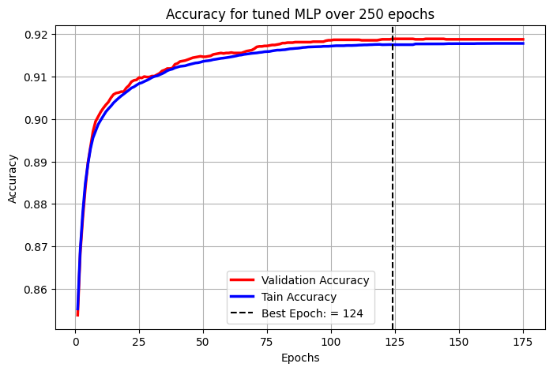
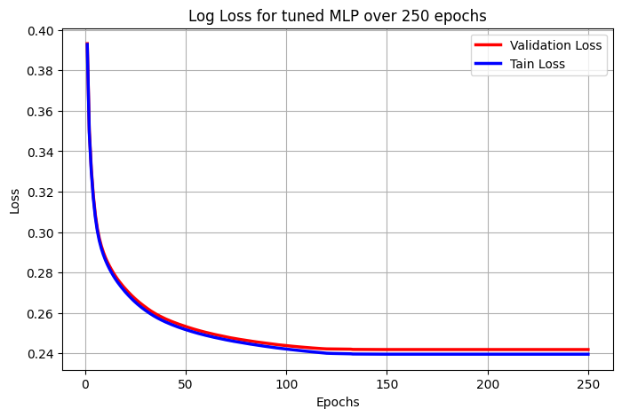
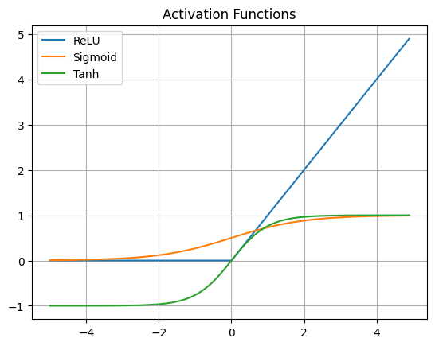
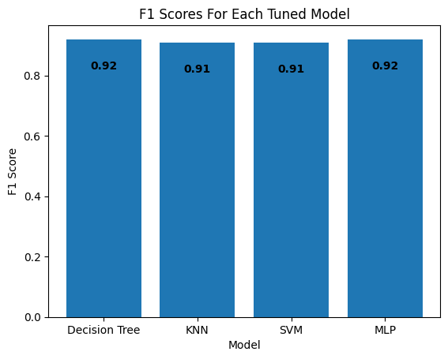
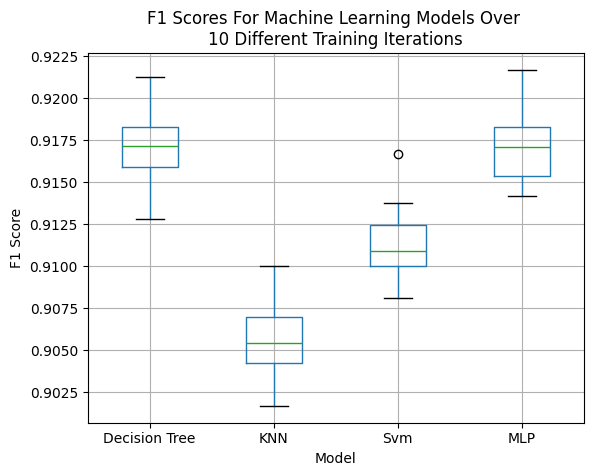

# 📊 Churn Prediction Models - Final Project (CS 472/572 - Spring 2025)

This repository contains my final project for **CS 472/572** (Spring 2025), where I evaluate different machine learning models for predicting churn. The project includes various models like **Decision Tree**, **K-Nearest Neighbors (KNN)**, **Support Vector Machine (SVM)**, and **Multi-Layer Perceptron (MLP)**, all tuned and evaluated for F1 score.

## 📝 Table of Contents
- [📄 Project Report](#project report)
- [📂 Files Overview](#files overview)
- [🛠️ Preprocessing](#preprocessing)
- [⚡ Model Implementations](#model implementations)
- [📊 Evaluation](#evaluation)
- [📈 Figures](#figures)
- [🤝 License](#license)

---

## 📄 Project Report
The full report detailing the background, experiments, and results of this project can be found in the following PDF:

- **[Machine Learning Report - CS472 - Justin Hatch - S25](https://github.com/jhatch3/ML-Churn_Report/blob/main/Machine%20Learning%20Report%20-%20CS472%20-%20%20Justin%20-%20Hatch%20-%20S25%20-%20F.pdf)**

---

## 📂 Files Overview

Here is a list of the main files in the repository:

- **`main.ipynb`**: Data cleaning, feature selection, and saving cleaned data into CSV files.
- **`decision_tree.ipynb`**: Implementation and tuning of the Decision Tree model. Includes F1 score and graphs.
- **`knn.ipynb`**: Implementation and tuning of the KNN model. Includes F1 score and graphs.
- **`svm.ipynb`**: Implementation and tuning of the SVM model. Includes F1 score and graphs.
- **`multi_layer_perceptron.ipynb`**: Implementation and tuning of the MLP model. Includes F1 score and graphs.
- **`helper.ipynb`**: Generates activation function graph and other helper plots.
- **`Data/`**: Raw and cleaned datasets.
- **`Figs/`**: Directory containing relevant figures for evaluation and results.

---

## 🛠️ Preprocessing

The preprocessing steps are outlined in **`main.ipynb`**. These include:
- Data cleaning (handling missing values, outliers, etc.)
- Feature selection using statistical methods
- Saving cleaned data to a CSV file for model training

---

## ⚡ Model Implementations

- **Decision Tree**: The model is implemented in **`decision_tree.ipynb`**. We explore hyperparameter tuning to improve the model's F1 score.
- **KNN (K-Nearest Neighbors)**: The model is implemented in **`knn.ipynb`**. Hyperparameters like the number of neighbors and distance metrics were tuned for optimal performance.
- **SVM (Support Vector Machine)**: In **`svm.ipynb`**, we applied grid search for hyperparameter optimization and evaluated the F1 score.
- **MLP (Multi-Layer Perceptron)**: The MLP model is implemented in **`multi_layer_perceptron.ipynb`**. We experimented with different activation functions and layers for better accuracy.

---

## 📊 Evaluation

The models were evaluated primarily using the **F1 score** for classification accuracy. F1 score was computed for each model in its respective notebook. The results were visualized through different plots, such as boxplots and accuracy vs. loss curves.

---

## 📈 Figures

Here are some key figures that represent the model performances:

- 
- 
- 
- 
- 
- 
- 
- 

---
